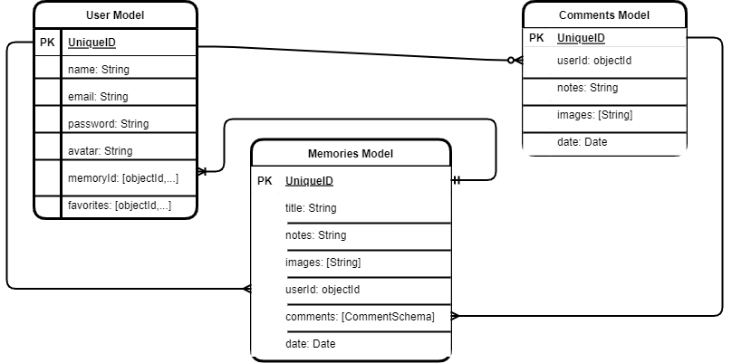

# Memories

Getting Old!!! no problem Memory is an app that allows users to keep a journal of any important events or memories. Users will be able to post their memories with images of the events as well as some notes with their thoughts.

## API
Cloudinary to allow users to upload photos to associate with each memory.

## MVP User Stories

- As an unregisterd user, I would like to sign up with email and password.
- As a registered user, I would like to log in with email and password.
- As a logged in user, I would like to log out.
- As a logged in user, I would like to create memory posts.
- As a logged in user, I would like to see all my posts.
- As a logged in user, I would like to see details on a specific post.
- As a logged in user, I would like to update my posts.
- As a logged in user, I would like to delete my posts.

## Stretch User Stories

- As a logged in user, I would like to associate my posts with other users.
- As a logged in user, I would like to leave comments on posts I've been associated with.
- 

## ERDs

## RESTful Routing Chart
### Server
| METHOD | ACTION | CRUD | DESCRIPTION |
|--------|--------|------|-------------|
| POST | /users/new | CREATE | siging up a user |
| POST | /users/login | | logging in a user |
| GET | /users/memories | READ | fetch all of a users memories |
| GET | /memories/:id | READ | fetch a specific memory |
| POST | /users/memories | CREATE | create a new memory |
| PUT | /memories/:id | UPDATE | update a specific memory |
| DELETE | /memories/:id | DESTROY | delete a specific memory |

## Wireframes
